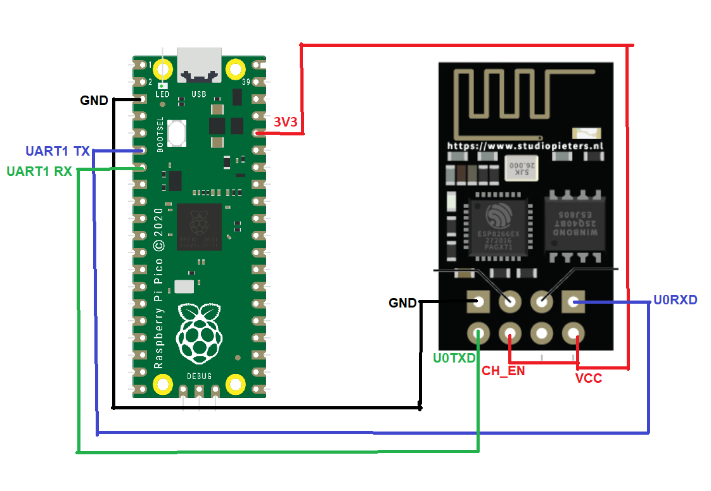

# Setup

## 1. Download [MicroPython](https://micropython.org/)

MicroPython binaries can be downloaded [here](https://micropython.org/download/rp2-pico/). This project was developed with MicroPython version 1.16.

## 2. Add MicroPython to Pico

Push and hold the BOOTSEL button (the white button near the Micro-USB port) and plug your Pico into the USB port of your computer. Release the BOOTSEL button after your Pico is connected. Pico should appear on your computer as a Mass Storage Device called **RPI-RP2**.

Drag and drop the downloaded file containing MicroPython to the RPI-RP2 volume. The Pico should then reboot automatically after which MicroPython is installed in the Pico.

## 3. Programming the Pico

The [**mpremote**](https://pypi.org/project/mpremote/) Python module can be used to write and execute MicroPython code directly on the Pico via REPL and to copy files from your computer to the Pico.

Install mpremote: `$ pip install mpremote`

In order to use mpremote, Pico must be connected to your computer.

### 3.1 Writing and executing MicroPython code via REPL

To start the REPL: `$ mpremote`

To exit REPL, press Control + Å (On Skandinavian keyboards)

### 3.2 Copying MicroPython scripts to Pico

To copy a MicroPython script `myfile.py` to Pico as `main.py`: `$ mpremote cp myfile.py :main.py`

If a MicroPython script is copied to the Pico with the name `main.py`, Pico will run it on any following startups. If the script is not meant to be executed during startup, it should be copied to the Pico with a different name.

To remove copied files from Pico: `$ mpremote rm :<filename>`

## 4. Connect Pico to ESP-01 module

Connect the ESP-01 module containing the **ESP8266** Wi-Fi microchip to the Pico by following the wiring displayed in the diagram below.  

# MicroPython scripts

[`test_led.py`](test_led.py): Use for testing that MicroPython works properly on Pico. Executing the script causes the Pico's onboard led to start blinking.

[`AT_terminal.py`](AT_terminal.py): Use for testing the connection between Pico and the ESP-01 module. Additionally, can be used to configure the ESP8266 Wi-Fi microchip through AT-commands. List for ESP8266 AT-commands can be found [here](https://www.electronicshub.org/esp8266-at-commands/). Executing the script turns the MicroPython REPL into an AT-terminal, where one can write AT-commands that get sent to the ESP8266.

# Pinouts

## Pico

## ESP-01

# Credits

This project was heavily inspired by [this Reddit post](https://www.reddit.com/r/raspberry_pi/comments/ld6ssg/giving_a_raspberry_pi_pico_internet_access_sort/).